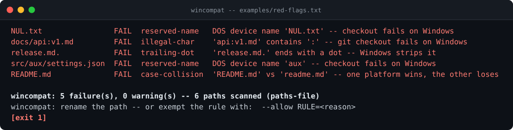
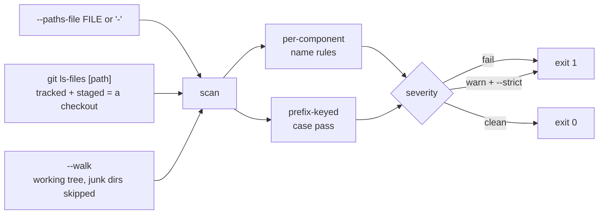

[](https://github.com/F0Rextasy/wincompat/actions/workflows/test.yml)
[](https://www.python.org/)
[](#what-it-will-never-do)
[](https://skills.sh/F0Rextasy/wincompat)
[](LICENSE)

# wincompat

**Catch the paths that break Windows checkouts - before your Linux CI
calls them fine.** DOS device names (`NUL`, `CON`, `AUX`, `COM1`...),
case-only collisions, trailing dots and spaces, illegal characters,
over-long paths: git on Windows refuses them, silently rewrites them, or
leaves a `nul` file no one can delete. `wincompat` is a deterministic
path gate - five rules, three scan sources, exit code as the verdict.



## The problem is real

- `git checkout` dies with `invalid path 'CON'`, `NUL`, `PRN` - paths
  Linux never questions ([Microsoft's own cross-platform
  guidance](https://learn.microsoft.com/en-us/azure/devops/repos/git/os-compatibility?view=azure-devops)
  lists these names as OS hazards).
- Windows still refuses the DOS-era folder names everyone tries sooner or
  later ([MakeUseOf: Windows still won't let you use this
  name](https://www.makeuseof.com/windows-still-wont-let-you-use-this-name-for-a-folder-dos-is/)).
- Vite has emitted a literal `nul` file that can't be deleted the normal
  way - people end up [writing dedicated
  cleaners](https://moeizaito.github.io/blog/delete-nul-file/).
- Meanwhile a repo with `README.md` **and** `readme.md` passes every
  Linux CI run, then silently loses one spelling per Windows/macOS
  checkout.

Your CI machine is almost never Windows. Your contributors are. This
repo runs one gate on both sides of that wall.

## Quickstart

```bash
# install the skill into any agent (Claude Code, Codex, Cursor, OpenCode, ...):
npx skills add F0Rextasy/wincompat

# or run it directly:
git clone https://github.com/F0Rextasy/wincompat
# gate a repository (git-tracked + staged paths):
python wincompat/scripts/wincompat your/repo --strict
# gate any list you already have (zip listing, snapshot, stdin):
printf 'NUL.txt\nreadme.md\nREADME.md\n' | python wincompat/scripts/wincompat --paths-file -
```

Exit `1` = a path fails (or warns under `--strict`), `0` = checkout-safe,
`2` = usage error. Requires Python 3.8+; git optional.

## Rules

Each path is checked **component by component** - directories break just
like files (`src/aux/settings.json` fails on `aux`):

| Rule | Severity | Fires when | Example |
| --- | --- | --- | --- |
| `reserved-name` | **fail** | a component's stem is a DOS device name (any case, any extension): `con`, `prn`, `aux`, `nul`, `com0`-`com9`, `lpt0`-`lpt9` | `NUL.txt`, `src/CON/` |
| `case-collision` | **fail** | two paths differ only by case - checked at **every ancestor prefix**, so `Docs/a.md` vs `docs/b.md` fires at the directory level | `README.md` vs `readme.md` |
| `trailing-dot` | **fail** | component ends with `.` - Windows strips it, the name changes | `release.md.` |
| `trailing-space` | **fail** | component ends with a space - same silent rewrite | `report.md ` |
| `illegal-char` | **fail** | component contains `<>:"|?*` or a control character (0x00-0x1F) | `api:v1.md` |
| `path-too-long` | warn | whole path exceeds 259 chars (MAX_PATH 260 minus NUL) - blocks only with `--strict` | a 300-char build path |

## Scan sources



| Source | When | Sees |
| --- | --- | --- |
| `--paths-file FILE` (`-` = stdin) | any time; mutually exclusive with a path argument | your newline list - `#` comments skipped, **trailing spaces are data** |
| `git ls-files` | default inside a repo | tracked + staged paths - exactly what a checkout produces |
| `--walk` | fallback outside a repo, or forced | every file under the root; skips `.git`, `node_modules`, `__pycache__`, `.venv`, `venv` |

## Evidence

Real output over `examples/red-flags.txt` (also rendered as the demo
above):

```console
$ python scripts/wincompat --paths-file examples/red-flags.txt --no-color
NUL.txt                FAIL  reserved-name   DOS device name 'NUL.txt' -- checkout fails on Windows
docs/api:v1.md         FAIL  illegal-char    'api:v1.md' contains ':' -- git checkout fails on Windows
release.md.            FAIL  trailing-dot    'release.md.' ends with a dot -- Windows strips it
src/aux/settings.json  FAIL  reserved-name   DOS device name 'aux' -- checkout fails on Windows
README.md              FAIL  case-collision  'README.md' vs 'readme.md' -- one platform wins, the other loses

wincompat: 5 failure(s), 0 warning(s) -- 6 paths scanned (paths-file)
wincompat: rename the path -- or exempt the rule with:  --allow RULE=<reason>
[exit 1]
```

Machine-readable verdict (`--format json`):

```json
{"ok": false, "counts": {"checked": 6, "fail": 5, "warn": 0, "exempt": 0},
 "source": "paths-file"}
```

The contract tests drive the real CLI over path lists - portable on
purpose: none of these paths can even be *created* on a Windows
filesystem, which is the entire point:

```console
$ python -m unittest discover -s tests -v
...
Ran 9 tests in 0.943s

OK
```

## Exemptions

`--allow RULE=reason` exempts the **whole rule**, demands a non-empty
reason, and echoes it in the summary and JSON (`exempt`). Unknown rule ->
usage error. Blanket-exempting `case-collision` to silence one finding
means renaming nothing and Windows still drops a path - the tool says so
in [the rules](references/RULES.md).

## CI wiring

```yaml
- name: paths must be checkout-safe on Windows
  run: python scripts/wincompat . --strict
- name: a red list must be caught
  run: |
    printf 'NUL.txt\nREADME.md\nreadme.md\n' > /tmp/red.txt
    python scripts/wincompat --paths-file /tmp/red.txt || test $? -eq 1
```

Both steps run in this repository's [test
workflow](.github/workflows/test.yml): the gate scans its own tree, and a
deliberately red list must exit 1.

## What it will never do

- **Read file contents.** Paths only - verdict is a pure function of the
  path list.
- **Execute anything, reach the network, or call a model.** Same list in,
  same rows out, on any machine.
- **"Fix" the tree itself.** Renaming a live `nul` on Windows deletes a
  device, not a file - the tool reports, you rename from where it's safe.

## One path, many gates — the family

| Repo | What its verdict means |
| --- | ---|
| [dsh-gate](https://github.com/F0Rextasy/dsh-gate) | the shell session actually ran - real commands, real files, real log |
| [sessionaudit](https://github.com/F0Rextasy/sessionaudit) | the session behaved - scope, secrets, destructive acts, self-contradicted claims |
| [cigate](https://github.com/F0Rextasy/cigate) | the workflows burn each minute once - pins, path filters, dedup, budget |
| [ci-triage](https://github.com/F0Rextasy/ci-triage) | one log, one verdict: regression / flaky / infra / pass |
| [docproof](https://github.com/F0Rextasy/docproof) | every README doc snippet is runnable, parsed, and verified in CI |
| [preflight](https://github.com/F0Rextasy/preflight) | the config is safe to ship - semantics, not syntax |
| [prove-it](https://github.com/F0Rextasy/prove-it) | every claim in this README is backed by real, captured output |
| [shipcheck](https://github.com/F0Rextasy/shipcheck) | the artifacts in `dist/` match `src/` - nothing stale ships |
| [testgate](https://github.com/F0Rextasy/testgate) | the tests that ran are the tests that exist - gaps, dupes, skips |
| [bandaid](https://github.com/F0Rextasy/bandaid) | the diff doesn't hide a silent failure - swallowed errors, dead guards |
| [wincompat](https://github.com/F0Rextasy/wincompat) | every path in the tree survives a Windows checkout |
| [compressproof](https://github.com/F0Rextasy/compressproof) | the context shrank without losing an answer - reversible compression, byte proof, answer-equivalence oracle |
| [uigate](https://github.com/F0Rextasy/uigate) | the UI stops looking like the same AI slop - measurable design-slop lint, WCAG + template tells |
| [aitell](https://github.com/F0Rextasy/aitell) | the prose stops reading as AI - deterministic AI-tell detection with a published confusion matrix |
| [route-drift](https://github.com/F0Rextasy/route-drift) | OpenAPI spec vs code routes drift gate |

MIT licensed. Contributed findings welcome - attach the path pattern and
the checkout error.
